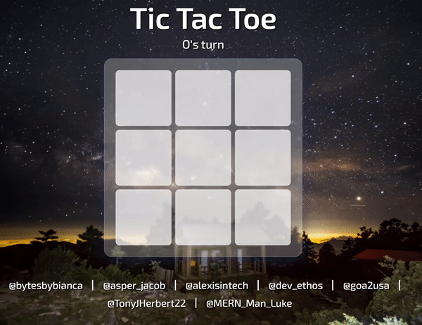

<h1 align="center">2–player Tic-Tac-Toe | <a href="https://2-player-tic-tac-toe.netlify.app">Visit here!</a></h1>

A 2–player tic-tac-toe game with win and draw validation

## How It's Made:

[@alexisintech](https://github.com/alexisintech), [@Ethodeus](https://github.com/Ethodeus), [@bytesbybianca](https://github.com/bytesbybianca), [@LucasMERN](https://github.com/LucasMERN), [@TonyHerbert22ATX](https://github.com/TonyHerbert22ATX), [@20jasper](https://github.com/20jasper) and I (@goa2usa) collaborated to build this project. We split into two groups—one group built the win and draw condition validation algorithms while the other styled the site and added support for user input.

<h2 align="center">Techs used:</h2>
 

    
    
    

## Lessons Learned:

This project helped us better understand how to split up work based on each person's strengths. We learned about how to utilize 2d arrays to better represent 2 dimensional grids. We discovered a method to add event listeners to every button without manually adding one for each one. Finally, after struggling to find the appropriate values to do what we wanted, we made the connection between SVG and CSS animation's positioning systems and tweaked the text box's slide in animation to perfection.

